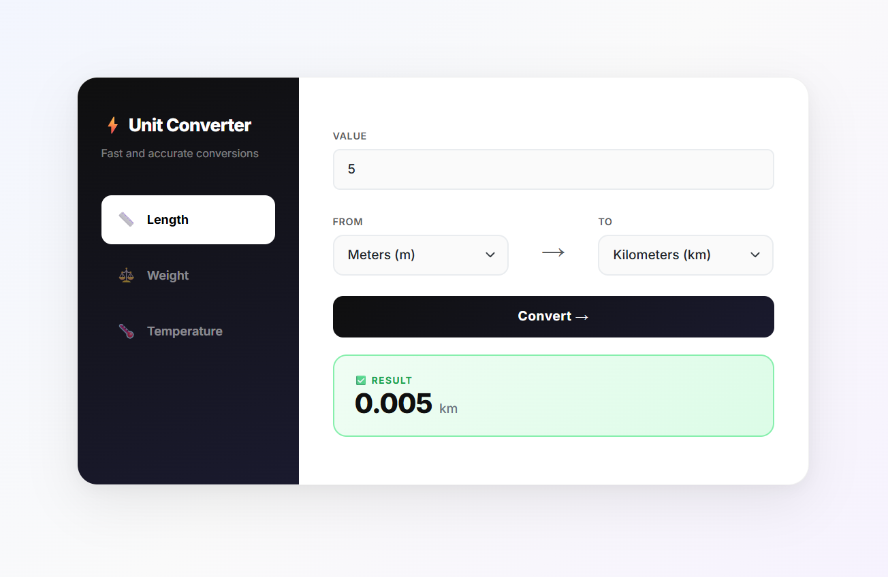

# ⚡ Unit Converter

A clean, modern unit converter built with **ASP.NET Core Razor Pages** and **Bootstrap 5**.

> Inspired by the [roadmap.sh Unit Converter project](https://roadmap.sh/projects/unit-converter).

---

## Features

- 📏 **Length** — Kilometers, Meters, Centimeters, Millimeters, Miles, Feet, Inches
- ⚖️ **Weight** — Kilograms, Grams, Milligrams, Pounds, Ounces, Metric Tons
- 🌡️ **Temperature** — Celsius, Fahrenheit, Kelvin
- Landscape layout — no scrolling needed
- Smooth fade animation on tab switch
- Input validation and error handling
- Clean result display after conversion

---

## Demo



---

## Tech Stack

- **Framework** — ASP.NET Core Razor Pages (.NET 8)
- **Frontend** — Bootstrap 5, Custom CSS, Inter font
- **Language** — C#

---

## Project Structure

```
UnitConverter/
├── Constants/
│   ├── LengthUnits.cs          # Length conversion dictionary
│   └── WeightUnits.cs          # Weight conversion dictionary
├── Models/
│   └── ConversionRequest.cs    # Input model with validation
├── Services/
│   ├── IConverterService.cs    # Service interface
│   └── ConverterService.cs     # Conversion logic
├── Pages/
│   ├── Index.cshtml            # Main page
│   ├── Index.cshtml.cs         # PageModel
│   └── Shared/
│       ├── _Layout.cshtml      # App layout
│       ├── _LengthTab.cshtml   # Length form partial
│       ├── _WeightTab.cshtml   # Weight form partial
│       └── _TemperatureTab.cshtml # Temperature form partial
└── wwwroot/
    ├── css/
    │   └── site.css            # All custom styles
    └── demo.png                # App screenshot
```

---

## Getting Started

### Prerequisites

- [.NET 8 SDK](https://dotnet.microsoft.com/download)

### Run locally

```bash
# Clone the repository
git clone https://github.com/Melvinots//unit-converter-webapp.git

# Navigate to project folder
cd UnitConverter

# Run the app
dotnet run
```

Then open your browser at `https://localhost:5001`

---

## How It Works

### Length & Weight
Uses a dictionary-based approach with a base unit (meters for length, kilograms for weight):

```csharp
// Step 1: convert input to base unit
double meters = val * LengthUnits.ToMeters[from];

// Step 2: convert base unit to target unit
return meters / LengthUnits.ToMeters[to];
```

### Temperature
Uses direct formulas since temperature scales have different zero points and cannot use simple multiplication:

```csharp
// Step 1: convert to Celsius
double celsius = from switch
{
    "F" => (val - 32) * 5.0 / 9.0,
    "K" => val - 273.15,
    _   => val
};

// Step 2: convert Celsius to target
return to switch
{
    "F" => (celsius * 9.0 / 5.0) + 32,
    "K" => celsius + 273.15,
    _   => celsius
};
```

---

## Architecture

| Layer | Responsibility |
|---|---|
| `Model` | Shape of input data and validation |
| `Service` | All conversion logic |
| `PageModel` | Handle HTTP request and response only |
| `cshtml` | Display only |

---

## License

MIT License — feel free to use and modify.

---

*Built with ASP.NET Core Razor Pages*
